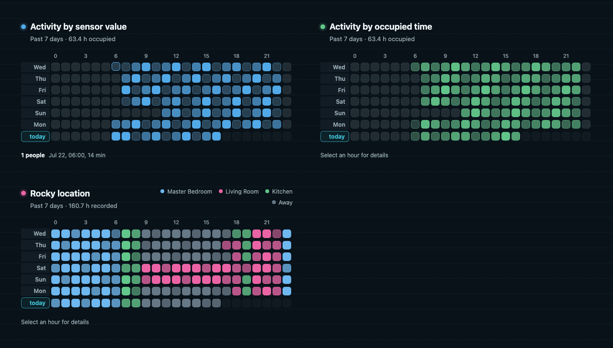

# Occupancy Heatmap Card

A Home Assistant dashboard card that turns recorder history into a day-by-hour occupancy heatmap. Numeric sensors use one color with duration-based intensity; categorical sensors use stable colors for their dominant state.



## Install with HACS

[](https://my.home-assistant.io/redirect/hacs_repository/?owner=wfchan&repository=ha-occupancy-heatmap-card&category=Lovelace)

1. Open HACS and select **Dashboard**.
2. Open the menu, choose **Custom repositories**, and add:

   ```text
   https://github.com/wfchan/ha-occupancy-heatmap-card
   ```

3. Select the **Dashboard** category, install **Occupancy Heatmap Card**, and refresh Home Assistant.
4. Add the card through the dashboard editor or YAML using `custom:occupancy-heatmap-card`.

## Numeric sensor

Values above `numeric_threshold` count as occupied. Cell intensity represents the fraction of that hour spent above the threshold.

```yaml
type: custom:occupancy-heatmap-card
entity: sensor.living_room_people
title: Living room activity
days: 7
mode: numeric
numeric_threshold: 0
numeric_color: "#52a9e8"
```

## Categorical sensor

The longest-duration state supplies each cell's color. Its duration supplies the intensity. Equal durations use the state active most recently.

```yaml
type: custom:occupancy-heatmap-card
entity: sensor.rocky_location
title: Rocky location
days: 7
mode: categorical
state_colors:
  Living Room: "#ea63a5"
  Master Bedroom: "#6eb7ef"
  Kitchen: "#62c78a"
  Away: "#667785"
show_legend: true
```

`mode: auto` is the default. It selects numeric mode only when every valid recorded state is a finite number.

## Options

| Option              | Type        | Default                  | Description                                        |
| ------------------- | ----------- | ------------------------ | -------------------------------------------------- |
| `entity`            | string      | required                 | Entity whose recorder history is displayed.        |
| `title`             | string      | entity name              | Card heading.                                      |
| `days`              | integer     | `7`                      | Number of local calendar days, from 1 through 31.  |
| `mode`              | string      | `auto`                   | `auto`, `numeric`, or `categorical`.               |
| `numeric_threshold` | number      | `0`                      | Numeric states above this value count as occupied. |
| `numeric_color`     | CSS color   | `#03a9f4`                | Numeric heatmap color.                             |
| `state_colors`      | map         | `{}`                     | Optional categorical state-to-color overrides.     |
| `excluded_states`   | string list | `unknown`, `unavailable` | States ignored during aggregation.                 |
| `show_legend`       | boolean     | `true`                   | Show categorical state colors above the grid.      |

The visual editor exposes the same options. Dates use Home Assistant's configured timezone and locale. Future hours remain empty, and daylight-saving hours use their actual elapsed duration.

## Manual installation

Download `ha-occupancy-heatmap-card.js` from the latest release, copy it to `config/www`, and add `/local/ha-occupancy-heatmap-card.js` as a JavaScript module dashboard resource.

## Development

```bash
npm install
npm test
npm run build
npm run test:e2e
```

Run `npm run dev` to open the mocked Home Assistant preview. Design and implementation records live in [`docs/superpowers`](docs/superpowers).

## License

[MIT](LICENSE)
